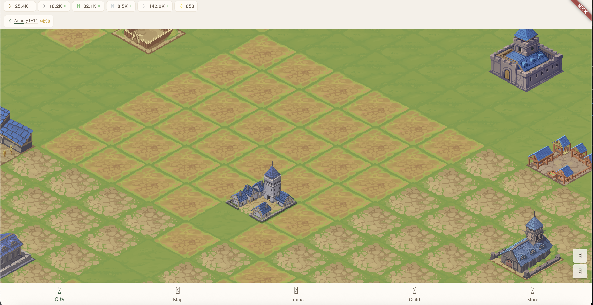
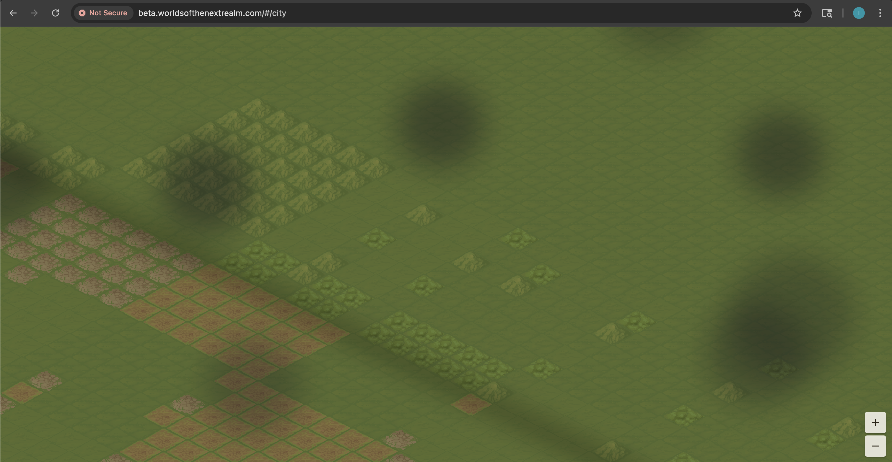

This is the first of a three-part series covering the development journey of Worlds of the Next Realm so far. In this post, we cover the foundation: standing up infrastructure, building the first services, and getting something on screen.

The timeline is aggressive. The first commit landed on February 8th, 2026. Nine days later, we had 11 repositories, a live beta environment, a working authentication system, a Flutter web client with isometric tile maps, and a backend serving real game data from DynamoDB.

## Day 1-2: The Foundation Sprint (Feb 8-10)

Everything started with the Flutter client and the AWS infrastructure.

The FrontEndClient repo received 12 PRs in the first two days. We scaffolded the entire application structure — domain models, theming, navigation, mock backend layer, and all the core UI screens: troops, leaders, research, guild, inventory, expeditions, barter, events, settings, chat, shop, and AI companion. Most of these screens were populated with mock data, but the architecture was real — Riverpod state management, GoRouter navigation, Dio HTTP client with interceptors.

The most significant piece was the isometric 2.5D tile map renderer built on the Flame game engine. This would become the city view and world map — the visual heart of the game.

Simultaneously, the Infra repo went up with CDK stacks for the VPC, DynamoDB tables, Application Load Balancer, and CloudFront distribution. We deployed the BackendApi on Lambda behind API Gateway, and the NotificationService and WorldSimulation on Fargate.

All three backend services had working CDK deployments by the end of day 2. The CI/CD pipelines were live — every push to main deployed to beta automatically.

## Day 3-4: The Data Layer (Feb 11-12)

This is where BackendCommon became the backbone of the project.

We built a generalized DynamoDB data store abstraction — a single-table design where every game entity (players, cities, buildings, resources, troops, worlds) lives in one table with partition key patterns and GSIs for alternate access patterns. The data store handles serialization, optimistic concurrency via version IDs, and batch operations.

The DynamoDB schema went through several iterations during these two days:

1. Started with a partition key + sort key design
2. Removed the sort key
3. Added GSI1
4. Added GSI2
5. Restored the sort key and added GSI1
6. Recreated the table as PK-only with GSI1

That's 6 PRs in the Infra repo just iterating on the table schema. Each change required coordinating across BackendCommon (data models), Infra (CDK table definition), and the services that read the data. This is one of the costs of a multi-repo architecture — schema changes ripple across repositories.

The OperationalTools CLI also came to life during this phase: `create-user`, `load-game-data`, `generate-map`, and `bootstrap-world` commands. These tools are essential for populating the game world with data — definition files for buildings, troops, resources, and research loaded from JSON into DynamoDB.

## Day 5: Authentication and API Wiring (Feb 13)

February 13th was one of the busiest days of the project. Across all repos, we merged PRs covering:

- **Authentication service**: Full username/password auth with RS256 JWT tokens, Argon2id password hashing, family-based refresh token rotation, and JWKS endpoint for public key distribution. The master encryption key went through its own evolution — first as a CDK context value, then moved to AWS Secrets Manager for proper secret management.

- **JWT middleware in BackendApi**: All API endpoints now verified authentication tokens. We added request/response models for all 22 planned endpoints and created stub handlers for each one.

- **Frontend auth integration**: The Flutter client was hooked up to the real authentication service. The mock login button was removed. Real JWT tokens flowed from login through to API calls.

- **Structured logging**: Every service got consistent JSON logging — critical for debugging in a distributed system where you need to correlate requests across Lambda, Fargate, and CloudWatch.

- **Security hardening**: CloudFront origin verify headers and WAF rules on the ALB to prevent direct access bypassing the CDN.

This was also the day of the "README wave" — every repo got a README, documentation links, and design doc references. Housekeeping, but important for a multi-repo project where anyone (human or AI) needs to find their way around.

## The First Render

Getting the isometric city to render with real data in the browser was the first real milestone. The early versions had... issues.

The bottom navigation bar icons were missing because of how Flutter web packages and deploys JSON-declared assets. It took a dedicated fix to properly deploy subdirectory JSON assets to S3.

The cloud overlay — intended to obscure the city exterior — was rendering far too aggressively. The terrain and buildings underneath were completely invisible. This would take several more days and multiple PRs to get right.

## What We Learned

**Multi-repo coordination is expensive.** A schema change in DynamoDB touches Infra (CDK), BackendCommon (models), BackendApi (endpoints), OperationalTools (data loading), and sometimes the FrontEndClient (API contracts). The NuGet package pipeline adds latency — you merge a BackendCommon PR, wait for CI to publish the package, then update dependent repos. We ended up with explicit rules: create the BackendCommon PR first, wait for CI, then create dependent PRs.

**Mock-first works.** Building the entire Flutter client with mock backends first meant we could iterate on UI and navigation without waiting for the real APIs. When the APIs were ready, we swapped in real repositories one at a time.

**CDK schema iteration is painful.** Six PRs to get the DynamoDB table right. Each one required a CDK deploy, which means CloudFormation stack updates, which means waiting for DynamoDB table operations to complete. Some of these were destructive — dropping and recreating the table. In a production environment, this would require careful migration planning.

---

## Stats: Days 1-5 (Feb 8-13)

| Metric | Value |
|--------|-------|
| Repositories created | 11 |
| PRs merged | 143 |
| Commits | ~310 |
| Services deployed | 5 (BackendApi, AuthService, NotificationService, WorldSimulation, FrontEndClient) |
| CDK stacks | 5 (VPC, DataStore, Web/ALB, CloudFront, PipelineOIDC) |
| DynamoDB schema iterations | 6 |
| Backend endpoints stubbed | 22 |
| Flutter screens built | 17 |
| NuGet packages published | 3 (BackendCommon, BackendCommon.Cdk, BackendCommon.Testing) |
| CI/CD pipelines | 8 (one per deployable repo) |

### Code Written (as of Feb 13)

| Language | Lines | Purpose |
|----------|-------|---------|
| Dart | ~14,000 | Flutter client |
| C# | ~6,500 | Backend services + shared libraries |
| TypeScript | ~520 | CDK infrastructure |
| Markdown | ~30,000 | Design docs, game data, READMEs |
| JSON | ~18,000 | Game definitions, config |
