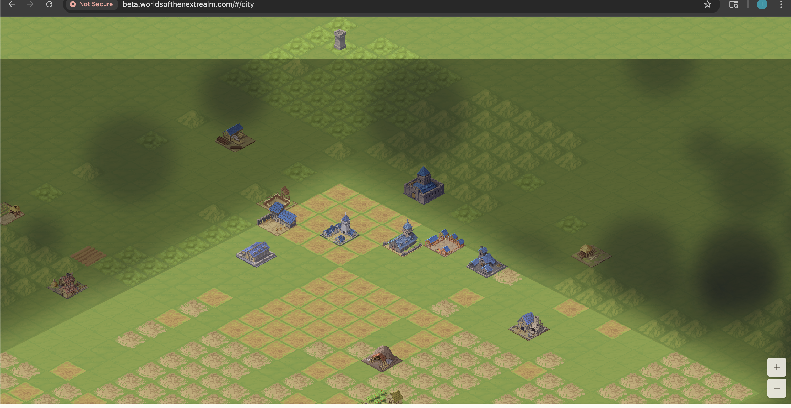
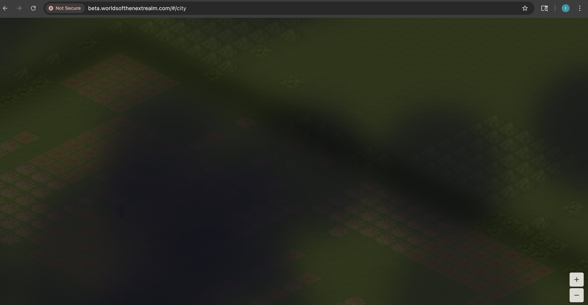
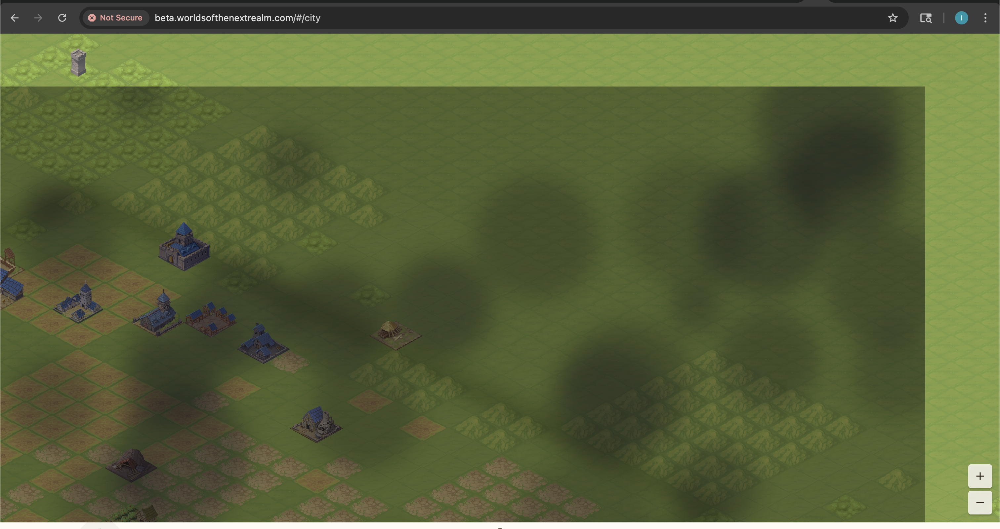
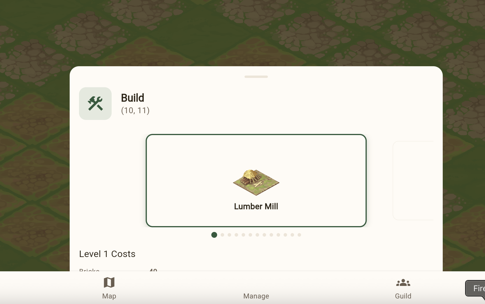
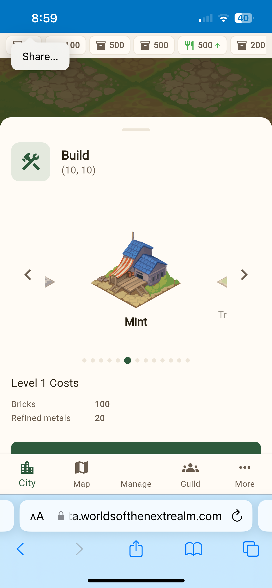

This is part two of our three-part development journey series. [Part 1](/p/dev-journey-part-1/) covered the foundation — standing up infrastructure and getting the first render on screen. This post covers the transition from "something renders" to "something plays."

The period from February 14th to 17th was where the game came alive — and where most of the visual bugs lived.

## The City Grid Problem (Feb 14-15)

The initial city grid was 50x50 tiles. On paper, that sounded reasonable. In the isometric renderer, it was too large — buildings were tiny, navigation was tedious, and the render performance suffered. But the bigger problem was visual.

Buildings at the grid edges clipped into empty space. The isometric diamond layout meant the rectangular browser viewport showed the diamond's corners — ugly gaps of nothingness. And the cloud overlay we'd been struggling with was still dominating the view.

The fix came in stages across multiple PRs:

1. **Resize to 20x20** — a dramatically smaller grid that kept buildings visible and navigation manageable
2. **Add grass border tiles** — filled the area beyond the grid diamond so the viewport always shows terrain
3. **Clamp the camera** — prevented scrolling beyond the rendered area
4. **Storm cloud rework** — the exterior overlay got completely reworked

## The Storm Cloud Saga

The cloud overlay deserves its own section because it consumed 6 PRs over two days. The idea was simple: the area outside your built city should have ominous storm clouds, creating a "fog of war" effect that makes the playable area feel like a clearing in the darkness.

The first implementation rendered clouds over the *entire* map and then punched a hole for the city. It looked like this:

The iteration went:

1. **Add storm cloud overlay** — initial implementation, way too thick
2. **Thicken storm clouds and increase lightning** — made it worse, but established the aesthetic direction
3. **Rebalance for 20x20 grid** — scaling adjustment after the grid resize
4. **Fix city bleed** — storm effects were bleeding into the city area
5. **Replace clipPath with saveLayer+dstOut** — the rendering approach itself was wrong. `clipPath` in Flutter's canvas wasn't compositing correctly with the tile renderer. Switching to `saveLayer` with Porter-Duff `dstOut` compositing mode fixed the bleed
6. **Fix hard edge at map corners** — the final cleanup

The progression from "cloud soup" to "atmospheric border" was a real lesson in iterative rendering. Each PR fixed one thing and revealed the next problem.

## Building Placement and the Real Backend

With the grid sorted, we wired up actual building placement. This required changes across four repos in sequence:

1. **BackendCommon**: Add building data models and road segment data
2. **BackendApi**: Add building placement and upgrade endpoints with DynamoDB storage
3. **OperationalTools**: Add city-buildings ops command for debugging
4. **FrontEndClient**: Wire up placement and upgrade API calls

The cross-repo dependency chain meant this feature took a full day even though the individual changes were straightforward. The NuGet pipeline adds latency — merge BackendCommon, wait for CI to publish, then update the other repos.

Hardcoded IDs were another pattern that needed systematic removal. The city view initially used `city-001` everywhere. The troop screens hardcoded `city-001`. World endpoints hardcoded `world-001`. Each hardcoded value was a separate PR to replace with the real ID from the player's session.

## The UI Overhaul (Feb 16)

February 16th was almost entirely a frontend day — 25 PRs merged in the FrontEndClient alone. This was the day the game started looking like a game.

**Management screens**: Resources, Buildings, and Research got dedicated tabs in a new Management screen. The bottom navigation grew from City/Map/Troops/Guild/More to City/Map/Manage/Guild/More.

**The carousel battles**: The build panel originally used a dropdown to select buildings. We replaced it with an image carousel showing building previews. This seemingly simple change spawned 5 PRs:

1. Replace dropdown with carousel
2. Fix navigation buttons and image sizing
3. Fix clipping on mobile viewports
4. Fix the build button being hidden behind the panel
5. Final height and layout adjustments

**Gesture handling**: Adding pinch-to-zoom to the isometric maps created a cascade of input conflicts. The tile tap handler consumed touch events that the zoom handler needed. The zoom gesture interfered with panning. Pan conflicted with tap detection. This produced 5 bug-fix PRs in sequence — each fixing one gesture interaction and breaking another, until the gesture recognizer configuration was right.

**The mobile experience**: The game runs in Safari on iOS as a progressive web app.

Mobile brought its own issues — the PWA standalone mode needed fixes to hide browser chrome, and touch gesture handling behaved differently than mouse events.

## Token Management

One practical problem: JWT access tokens expire after 6 hours. When a player's session runs long enough, API calls start returning 401s. We added automatic token refresh — when a 401 comes back, the Dio HTTP interceptor transparently refreshes the access token using the stored refresh token and retries the original request. The user never sees the expiration.

## Observability

On the backend side, we added Embedded Metric Format (EMF) logging to the BackendApi. Every API request now emits structured metrics to CloudWatch — request count, latency, and status code breakdown (2xx, 4xx, 5xx). Getting EMF right took 4 PRs:

1. Add EMF request metrics middleware
2. Fix to emit single structured object (not multiple)
3. Fix Dimensions array format per CloudWatch spec
4. Align metric names with property names

The CloudWatch EMF specification is finicky about formatting. Small deviations cause metrics to silently not appear in CloudWatch — no error, just missing data. Each fix was discovered by checking CloudWatch and finding empty graphs.

---

## Stats: Days 6-9 (Feb 14-17)

| Metric | Value |
|--------|-------|
| PRs merged | 94 |
| Frontend PRs | 62 |
| Backend PRs | 22 |
| City grid iterations | 3 (50x50 → 20x20 → final layout) |
| Storm cloud PRs | 6 |
| Gesture handling bug fixes | 5 |
| Carousel UI iterations | 5 |
| EMF metrics iterations | 4 |
| Hardcoded ID replacements | 5 |
| New API endpoints (real, not stubs) | 18 |

### Code Growth (Feb 14-17)

| Language | Lines Added | Total |
|----------|-------------|-------|
| Dart | ~12,500 | ~26,500 |
| C# | ~9,200 | ~15,700 |
| TypeScript | ~100 | ~625 |
| Markdown | ~8,000 | ~38,000 |
| JSON | ~2,000 | ~20,000 |

### Feature Velocity

| Day | PRs Merged | Key Features |
|-----|-----------|--------------|
| Feb 14 | 16 | Server-backed maps, city resize, iOS PWA, post-login flow |
| Feb 15 | 28 | Storm clouds, road rendering, building placement, world simulation phase 1, mock removal |
| Feb 16 | 32 | Management screens, carousel, pinch-to-zoom, token refresh, EMF metrics, troop training UI |
| Feb 17 | 18 | Research trees, building definitions, worker staffing, tile bonuses, blog launch |
