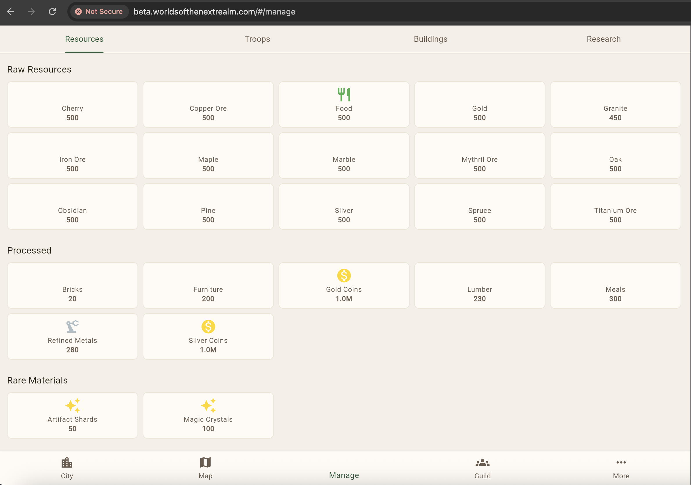

This is the final part of our three-part development journey series. [Part 1](/p/dev-journey-part-1/) covered the foundation. [Part 2](/p/dev-journey-part-2/) covered building the game features. This post covers what we learned — about the process, about AI-assisted development, and about what the numbers actually tell us.

## The Process Evolved

When the project started on February 8th, the process was simple: write code, push to main. By February 17th, we had a structured system of rules, templates, and guardrails. Every rule exists because something went wrong.

### Workspace Boundaries

**The rule**: Never look in or modify files above the repository root. Each workspace is independent.

**Why it exists**: In a multi-repo project with an AI coding assistant, context bleed is a real risk. Claude might read a file in BackendApi and then make assumptions about BackendCommon based on what it saw — assumptions that could be wrong if the repos are at different points in their development. Keeping each workspace isolated forces explicit cross-repo coordination through published packages and documented interfaces.

### NuGet Versioning

**The rule**: Never manually change `<Version>` in `.csproj` files. Never run `dotnet nuget push`. CI handles all versioning and publishing.

**Why it exists**: The BackendCommon package is consumed by 4 other repos. The CI pipeline uses `github.run_number` as the patch version, giving every build a unique version. Early in the project, manual version bumps caused conflicts where two builds produced the same version number. The fix was simple — take humans and AI out of the versioning loop entirely.

The cross-repo workflow is now explicit: create the BackendCommon PR first, wait for CI to publish the new package version, then create PRs in the dependent repos. The dependent repos use `0.1.*` wildcard references so they pick up new patches automatically.

### PR Workflow

**The rule**: Every PR requires three things: the PR itself, a review comment covering reasoning and concerns, and a session stats comment with token usage and interaction quality metrics.

**Why it exists**: The stats comment requirement was added after several PRs were created without tracking information. Since the human-AI collaboration is itself something we're studying, losing that data means losing insight into what's working. The "never defer" requirement prevents the stats from being forgotten — they must be posted in the same step as creating the PR.

### The "Open Source" Mistake

One of the clearest examples of AI needing oversight: in our first blog post, Claude described the project's code as "open source." It's not. This is a commercial game that will be monetized. Claude defaulted to "open source" framing because that's the most common pattern in developer blogs on GitHub.

The fix was twofold: correct the blog post, and add an explicit rule to CLAUDE.md stating this is a commercial project. Rules like this are how you calibrate AI behavior — not through hoping it gets the context right, but through explicit documentation.

## Debugging Patterns

Nine days of rapid development produced a collection of debugging patterns — things that went wrong and how we fixed them.

### CDK and AWS

**OIDC Token Expiry**: GitHub Actions OIDC tokens expire after about an hour. If a CDK deployment waits too long for ECS service stabilization (which can happen when health checks fail), the token expires mid-deploy and the stack gets stuck. The fix: use `cancel-update-stack` to trigger a faster rollback instead of waiting.

**ALB Outbound Rules**: CDK defaults ALB security groups to `allowAllOutbound: false`. When Fargate targets are in a different CDK app, health checks time out with `Target.Timeout` errors. The fix is explicit: `alb.connections.allowToAnyIpv4(ec2.Port.allTraffic())`. This was painful to debug because the ALB appeared healthy — it just couldn't reach the targets.

**S3 BucketDeployment Pruning**: Multiple `BucketDeployment` constructs pointing at the same S3 bucket will delete each other's files unless you set `prune: false` on all of them. The Flutter web build and the JSON asset definitions were in separate deployments, and one kept deleting the other.

**CloudFormation Stack States**: After a failed deploy, the stack enters `UPDATE_ROLLBACK_COMPLETE_CLEANUP_IN_PROGRESS`. You cannot deploy again until it reaches `UPDATE_ROLLBACK_COMPLETE`. This can take several minutes. We learned to wait rather than repeatedly retry.

### Flutter Web

**Asset deployment**: Flutter web packages certain assets (like Material icons) via JSON manifests. If the S3 deployment doesn't include subdirectory JSON assets, icons render as blank squares. This showed up as missing navigation icons in the first deployed build.

**Gesture conflicts**: The isometric tile maps use tap detection for selecting tiles and pinch-to-zoom for camera control. Flutter's gesture arena system means only one gesture recognizer wins per pointer event. Getting tap, pan, and pinch to coexist required careful configuration of `GestureDetector` and `InteractiveViewer` — 5 PRs of trial and error.

**Cache busting**: The first approach used query parameters (`flutter_bootstrap.js?v=timestamp`) but browsers and CDNs handle query-param caching inconsistently. We switched to content-hash file renaming — the build step renames files with their hash, guaranteeing that changed content gets a new URL.

## The Troop Training UI

The troop training screen is a good example of iterative design working well. It went through a complete transformation:

 across the top, a carousel showing the selected troop type with artwork, tier selection, quantity controls, and cost breakdown.")

The original design used a dropdown to select troop type and a number input for quantity. Through iteration:
- The dropdown became category filter tabs (Battle, Gathering, Mining, Farming, Factory, Labor, Magical)
- The number input became a slider with preset buttons (10, 50, 100)
- Troop artwork was added via carousel
- Cost breakdown shows per-unit and total cost
- Training time is calculated dynamically

Each step was a separate PR. None were planned as a sequence — each iteration responded to what the previous version looked like when actually used.

## Data-Driven Everything

A recurring theme in the later development was replacing hardcoded values with data-driven definitions.

**ResourceType**: Started as a Dart enum. Replaced with a string that maps to server-defined resource definitions. This allows adding new resource types without a client update.

**BuildingType**: Same pattern — started as an enum, replaced with data-driven definitions loaded from the server's building definitions endpoint.

**Research tracks**: Originally linear tracks (each research unlocks the next in sequence). Replaced with a tree structure where research nodes can have multiple prerequisites and unlock multiple children.

The pattern is always the same: start with the simplest thing that works (an enum), discover you need more flexibility, replace with server-defined data. This is pragmatic engineering — you don't build the flexible system until you need the flexibility.

## The Resource Icon Problem

Even at the end of 9 days, not everything is polished. The resource management screen still has missing icons for most resource types:

The game asset library has thousands of icons, but the mapping from resource definition to icon asset isn't complete. This is the kind of polish work that takes time but isn't blocking — the game is functional, the icons are a visual gap.

## Honest Assessment

Nine days is a short time. What we have is a vertical slice — infrastructure to UI, real data flowing through real services, deployed to a real AWS environment. But it's not a game you'd want to play yet. Major systems are still stub implementations. Combat doesn't resolve. Guilds aren't functional. The marketplace doesn't exist. The AI companion is a configuration screen with no backend logic.

The AI-assisted development approach made the foundation phase dramatically faster. Scaffolding 11 repos with CI/CD, CDK stacks, data models, and Flutter screens in under a week would have been months of solo work. But the speed came with a cost — every line needed review, some assumptions were wrong (like the "open source" framing), and debugging AI-generated code requires understanding code you didn't write.

The value is real. The risks are real. And we're 9 days in.

---

## Project-Wide Stats (Feb 8-17, 2026)

### Development Activity

| Metric | Value |
|--------|-------|
| Calendar days | 9 |
| Repositories | 11 |
| Total commits | 477 |
| Total PRs merged | 237 |
| Avg PRs per day | 26 |
| Most active day | Feb 16 (32 PRs) |
| Avg commits per day | 53 |

### PRs by Repository

| Repository | PRs | Focus |
|-----------|-----|-------|
| FrontEndClient | 80 | Flutter game client |
| BackendApi | 40 | Game API endpoints |
| BackendCommon | 31 | Shared libraries |
| Infra | 19 | AWS infrastructure |
| Documentation | 18 | Design docs, game data |
| OperationalTools | 17 | CLI ops tooling |
| AuthenticationService | 11 | JWT auth service |
| WorldSimulation | 9 | Event processing engine |
| NotificationService | 8 | Real-time notifications |
| Blog | 2 | This site |
| Assets | 2 | Game artwork |

### Codebase Size

| Language | Files | Lines | Purpose |
|----------|-------|-------|---------|
| C# | 226 | 15,720 | Backend services, shared libs |
| Dart | 190 | 26,533 | Flutter game client |
| TypeScript | 11 | 625 | CDK infrastructure |
| **Code subtotal** | **427** | **42,878** | |
| Markdown | 65+ | 38,000 | Design docs, game data, READMEs |
| JSON | 50+ | 20,000 | Game definitions, config |
| **Total** | **540+** | **100,000+** | |

### Services Deployed

| Service | Runtime | Deployment |
|---------|---------|------------|
| BackendApi | .NET 8 Lambda | API Gateway |
| AuthenticationService | .NET 8 Lambda | API Gateway |
| FrontEndClient | Flutter Web | S3 + CloudFront |
| NotificationService | .NET 8 Fargate | ALB |
| WorldSimulation | .NET 8 Fargate | ECS |

### Game Features Implemented

| Feature | Status |
|---------|--------|
| Authentication (login, register, JWT refresh) | Complete |
| City view with isometric rendering | Complete |
| World map with tile data | Complete |
| Building placement and upgrades | Complete |
| Resource tracking and definitions | Complete |
| Troop training UI | Complete |
| Research tree system | Complete |
| Management screens (Resources, Buildings, Research) | Complete |
| EMF metrics and observability | Complete |
| Operational tooling (user/data/map management) | Complete |
| Combat resolution | Stub |
| Guild system | Stub |
| Marketplace | Stub |
| AI companion logic | Stub |
| Notification delivery | Framework only |

### Process Artifacts

| Artifact | Count |
|----------|-------|
| CLAUDE.md rules documents | 3 (root, OperationalTools, Blog) |
| CI/CD pipelines | 8 |
| NuGet packages maintained | 3 |
| Design documents | 17 (HLD, 10 API LLDs, data model, simulation, notifications, Flutter, auth) |
| Game definition JSON files | 20+ |
| Documented debugging patterns | 8 |
