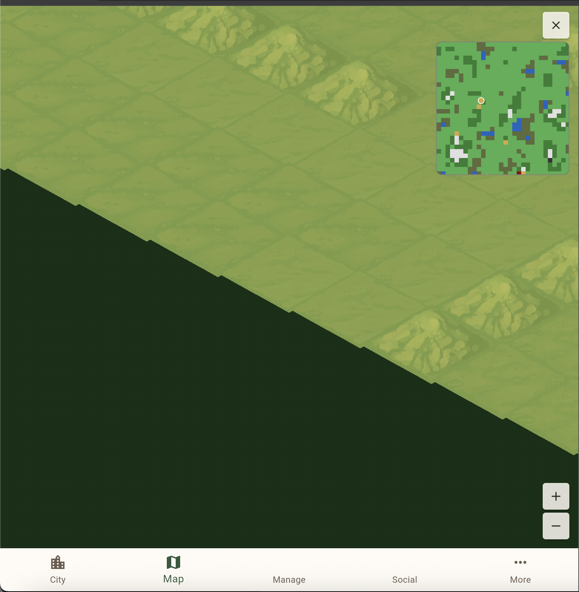
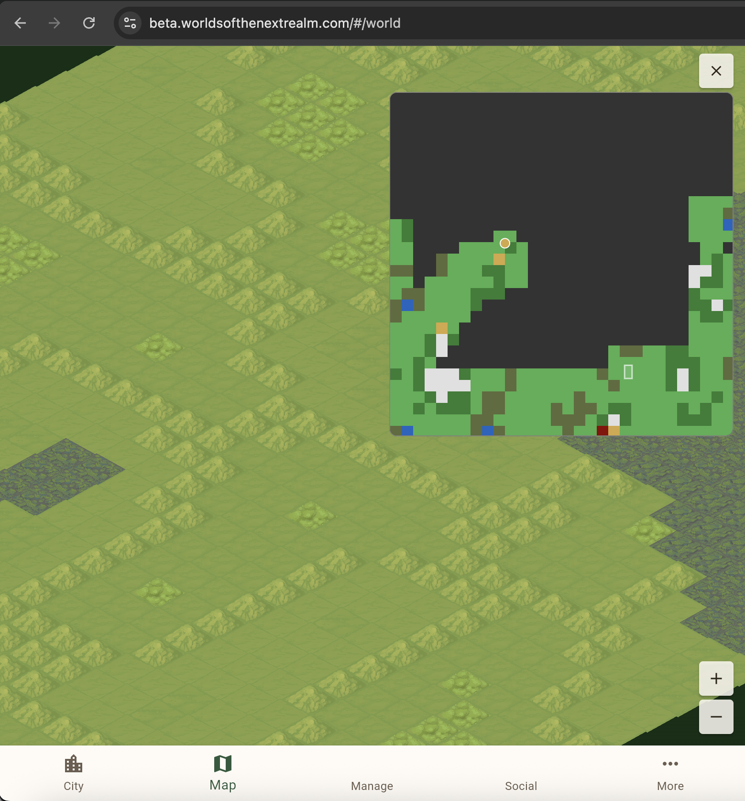
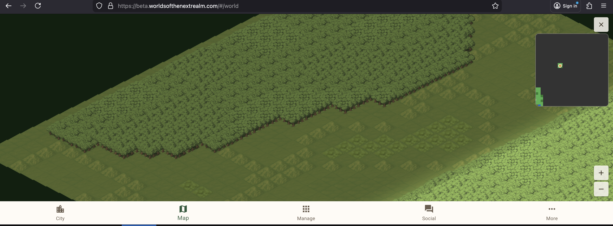

I'm building a browser-based strategy game called Worlds of the Next Realm with Claude Code as my AI pair-programmer. The world map is a 600x600 isometric tile grid — forests, deserts, mountains, volcanoes — loaded as chunks from CloudFront. This post covers two sessions that improved the map experience and the cascade of fixes each one triggered.

## The Mini-Map

The world is big. At normal zoom, you see maybe 30 tiles in each direction. Pan around for a while and you've lost all sense of where you are on the 600x600 grid. The solution is the oldest trick in game UI: a mini-map.

### v1: Client-Side Chunk Sampling

The first version (PR #167, FrontEndClient) is a Flutter widget overlaid on the world map screen — not a Flame engine component. This was a deliberate choice. The mini-map needs device-pixel rendering and Flutter gesture handling (tap to navigate, drag to pan), which are awkward to implement inside the game engine's coordinate system.

Each loaded chunk contributes one colored block to the mini-map based on its center tile's biome: green for grass, dark green for forest, tan for desert, white for snow, dark red for volcanic, olive for swamp, blue for water, gray for mountain. Unloaded chunks render as dark fog.

That fog-of-war effect wasn't designed — it fell out of the architecture. The world map uses lazy chunk loading from CloudFront. You only have the chunks around your viewport on the client. The mini-map can only render what's been fetched, so unexplored regions are naturally dark. Sometimes constraints produce good game features.

The killer feature is tap-to-navigate. Tap anywhere on the mini-map and the main camera pans to that world position. Drag to continuously update. On a 600x600 world, this changes the map from something you slowly scroll through to something you can jump around instantly.



### v2: Pre-Rendered PNG

The chunk-sampled mini-map was functional but crude — 30x30 effective pixels (one per chunk) stretched to 180x180 screen pixels. We doubled the widget to 360px and moved terrain rendering to the deployment pipeline.

The `publish-s3` command in the Documentation repo now generates a 600x600 PNG (one pixel per tile) using ImageSharp during deployment. Pure managed .NET, no native dependencies, runs anywhere including CI. The resulting PNG is tiny — biome regions produce large blocks of identical color that PNG's deflate compression handles efficiently. It gets uploaded alongside chunk data and the client fetches it on map load.

The mini-map painter now has three layers:
1. **Base terrain** — the pre-rendered PNG at full tile resolution, or chunk-based fallback if the fetch fails
2. **Features** — plumbed in for future dynamic markers (mines, monsters, quests) but currently empty
3. **Overlays** — viewport rectangle and city dot

The fallback is important. Old deployments that predate the PNG generator still work — the fetch 404s silently and the chunk-based rendering continues. No feature flags, no version checks. Try the better path, fall back to the existing one.



### The Hash Versioning Gotcha (Again)

The deployment pipeline uses content hashing for change detection. SHA-256 the input data, compare to the previous hash, skip upload if unchanged. Efficient — most CI runs finish in seconds.

But adding a PNG generator doesn't change the input data. The hash matched the previous deployment. The pipeline said "nothing changed" and skipped everything. The PNG was never uploaded.

This is a pattern we've hit before. Content-addressable systems track *what* is stored, not *what artifacts you produce from it*. We'd already solved this once by adding a format version prefix to the hash. This time we bumped it from `v3` to `v4` — same fix, same lesson, different day.

Worth noting: we added a code comment this time. "Bump this when changing the set of uploaded artifacts." Future us will thank present us.

## Edge Treatment

With the mini-map encouraging players to jump to any part of the world, the map edges became visible for the first time. At full zoom-out, panning to a corner revealed `backgroundColor: 0xFF1A3A1A` — a flat dark green void past the tile grid. Not a great look.

The city map already solved this problem. `IsometricGround` has an `overflow` parameter that renders extra tiles beyond the grid boundary, and `StormCloudOverlay` draws animated storm clouds with lightning over the edges. The city map uses 40 base + 20 detail puffs for the clouds, punching a diamond-shaped hole through the cloud layer with `saveLayer` + `BlendMode.dstOut`.

For the world map (PR #168), the fix was three small changes:
1. Set `overflow: 20` on the world map's ground component
2. Add `StormCloudOverlay` with 200 base + 100 detail puffs (proportional to the larger area)
3. Lower `minZoom` from 0.625 to 0.5 for one extra zoom-out step

The overflow tiles render as default grass via `MapChunkCache.getTileAt` returning the fallback for out-of-bounds coordinates. The storm clouds cover everything beyond the tile grid. Three changes, zero special-casing.

The lesson here is that reusable components pay off quietly. The city map's edge treatment was designed for one context. Months later, it applied to a completely different map with only parameterization changes.

## Variable Chunk Size

The world map was divided into 20x20 tile chunks — 30 chunks per axis, 900 chunks total per world. This was hardcoded everywhere: backend, frontend, deployment pipeline, operational tools. The number 20 appeared as constants in four repositories.

We changed it to 50. Here's why: 600 / 50 = 12 chunks per axis = 144 chunks per world instead of 900. Fewer chunks means fewer HTTP requests during loading, fewer S3 objects, and faster manifest processing. The tradeoff is larger individual chunk files, but gzipped JSON for a 50x50 tile grid is still small.

The change touched every repo in the project:

**BackendCommon**: Added `ChunkSize` (default 50) to `WorldDefInput` and `WorldDefinitionData`. The field flows through serialization as `"chunkSize"` / `"cks"`.

**Documentation**: Removed the hardcoded constant from `PublishS3Command`, added `"chunkSize": 50` to all five world entries in `world-definitions.json`, bumped the hash version to `v4` (including chunk size in the hash so changes force map regeneration).

**OperationalTools**: Removed constants from `GenerateMapCommand`, `BootstrapWorldCommand`, and `PublishGameDataCommand`. Added a `--chunk-size` CLI option.

**FrontEndClient**: This was the most involved. Removed `chunkSize`, `worldSize`, `chunksPerAxis`, `worldGridWidth`, and `worldGridHeight` from `IsoConfig`. Made `WorldMapScreen._initGame()` async to load the manifest first and extract map dimensions before creating the game. `MapChunkCache` now takes `chunkSize` as a constructor parameter. The mini-map reads dimensions from the game instance instead of constants.

The key design decision: chunk size is per-world, defined in the world definitions file and carried through the manifest. The client reads it dynamically. Old manifests with `chunkSize: 20` still work. No hardcoded world dimensions remain in the client.

## The Viewport Bug

Lowering `minZoom` from 0.625 to 0.5 during the edge treatment work exposed a rendering bug that took two PRs to fix.



At 0.5x zoom, tiles disappeared from the upper-left and lower-right corners of the screen. The first fix (PR #171) was straightforward: `updateVisibleTiles` was receiving the raw screen `size` to calculate which tiles to render, but at 0.5x zoom the viewport in world coordinates is `size / 0.5 = size * 2`. Passing `size / zoom` instead of bare `size` was the obvious correction.

It wasn't sufficient. Tiles were still missing at the corners.

The deeper issue (PR #172) was in the isometric math. The tile range calculation treated X and Y independently:

```
tilesX = viewportWidth / tileWidth / 2
tilesY = viewportHeight / tileHeight / 2
```

But isometric projection rotates the grid 45 degrees. A screen rectangle maps to a rotated diamond in grid space. The screen's top-right corner needs tiles far in the +X direction, the bottom-left needs tiles far in -X, and *both corners contribute to the Y range*. Independent axis calculations don't account for this rotation.

The correct formula uses the inverse isometric transform to find the maximum grid extent needed to cover all four screen corners:

```
gridRange = (halfW / halfTileWidth + halfH / halfTileHeight) / 2
```

This produces a symmetric range for both grid axes. On a portrait phone at 0.5x zoom, the old formula gave ±14 tiles (barely covering the ±13.35 needed). The new formula gives ±18 tiles — a comfortable buffer.

The lesson: isometric rendering bugs are subtle because the relationship between screen space and grid space is rotated. Calculations that work fine at high zoom (where the viewport is small enough that the rotation doesn't matter) break at low zoom where the aspect ratio stretches the diamond. Always think in terms of the inverse transform.

## Features Expose Problems

There's a pattern across both sessions worth calling out. Every feature we added exposed a pre-existing issue:

- The **mini-map's tap-to-navigate** sent players to map corners they'd never visited → exposed the ugly edge background
- The **edge treatment's extra zoom level** made the viewport larger → exposed the tile culling bug
- The **pre-rendered PNG** added a new artifact to the deployment → exposed the content-hash blind spot (again)
- The **variable chunk size** change touched hardcoded constants in four repos → exposed how tightly coupled the repos were to a single magic number

None of these problems were new. They'd been there since the code was written. They were invisible because nothing exercised those code paths until the new features did.

This is worth internalizing for any development project, AI-assisted or not: polish work and UX improvements are stress tests. When you make a system more usable, you make more of its surface area visible, and some of that surface area has rough edges you never noticed.

## The Honest Scorecard

| Session | Planned PRs | Fix-Up PRs | Repos Touched |
|---------|-------------|------------|---------------|
| Mini-map + edge treatment | 2 | 6 | 4 (FrontEndClient, Documentation, BackendCommon, BlogNotes) |
| Variable chunk size | 4 | 0 | 4 (BackendCommon, Documentation, OperationalTools, FrontEndClient) |

The mini-map session ballooned because each feature revealed something downstream. The variable chunk size session was clean — the plan was scoped correctly and all callers were identified upfront. The difference? The chunk size change was a known, bounded transformation (find every hardcoded 20, make it configurable). The mini-map was exploratory — we didn't know what "add a mini-map" would surface until we deployed it.

Both outcomes are fine. What matters is recognizing which type of task you're starting so you can calibrate your expectations.

---

*This post is part of a series about building Worlds of the Next Realm with Claude Code. Code is real, mistakes are real, the map finally has proper edges.*
